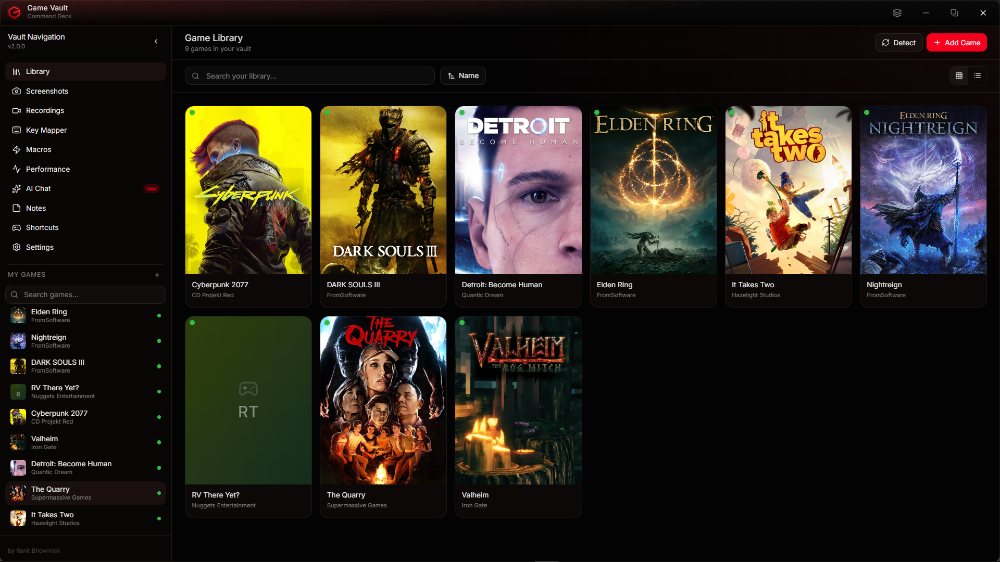
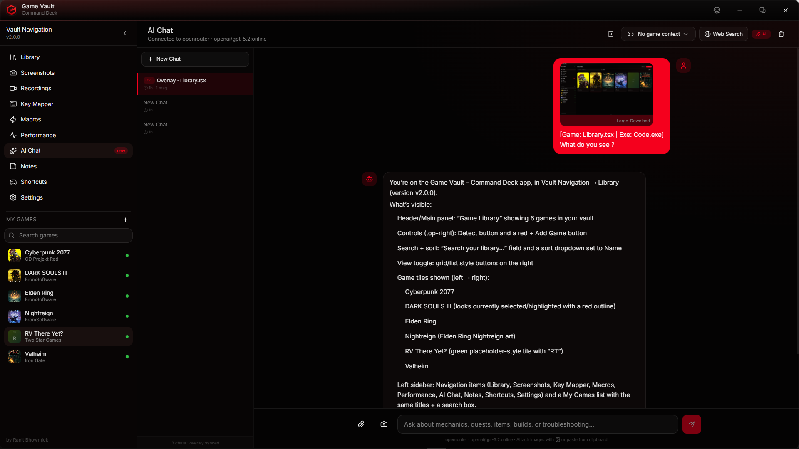
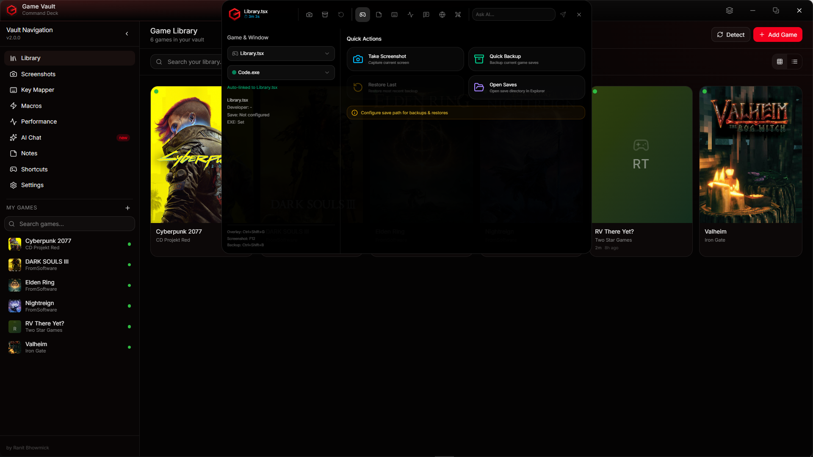
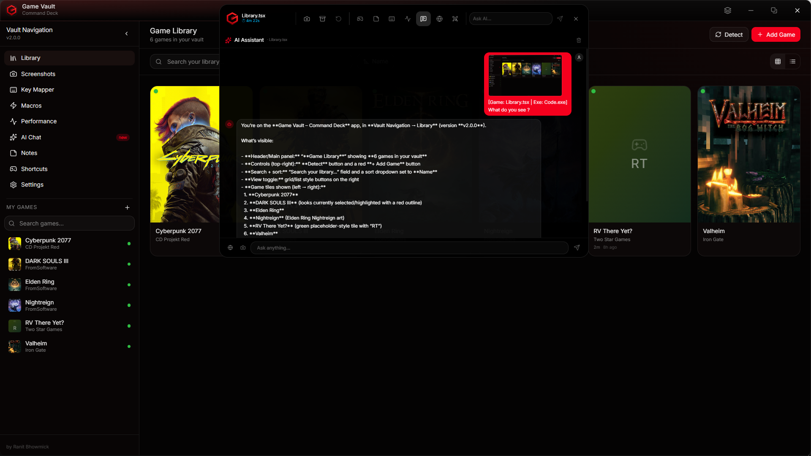
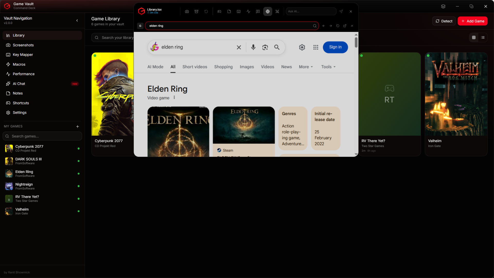
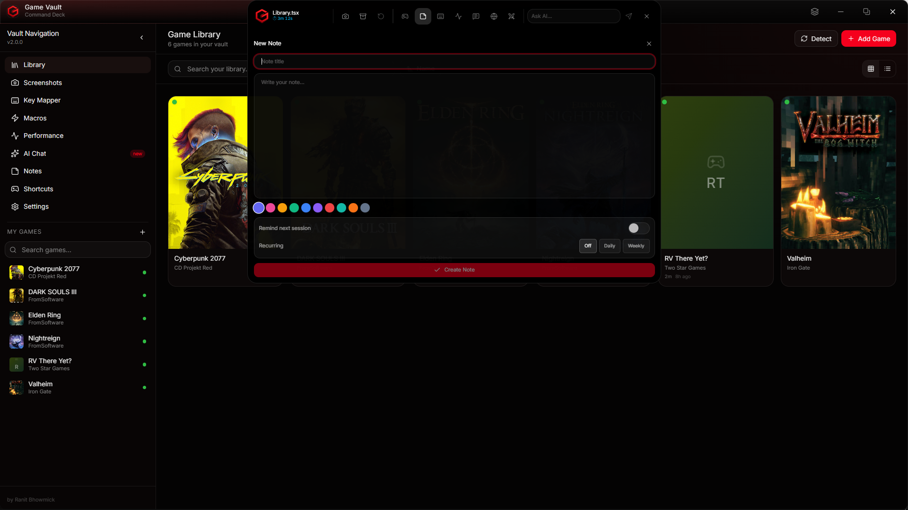
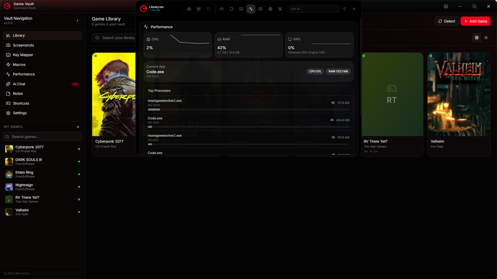
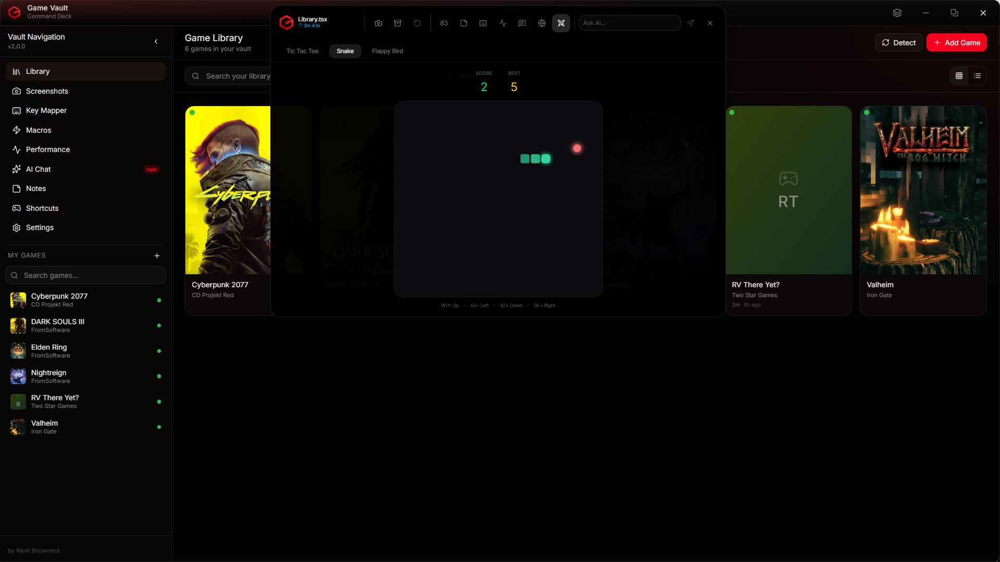

<p align="center">
  
</p>

<p align="center">
  
</p>

<h1 align="center">Game Vault</h1>

<p align="center">
  <strong>The Ultimate Game Save Manager & Gaming Toolkit</strong>
</p>

<p align="center">
  Backup, restore, organize, and protect your game saves - with AI chat, screen capture, key remapping, macros, an in-game overlay, and so much more.
</p>

<p align="center">
  <a href="https://github.com/Kawai-Senpai/GameVault/releases"></a>
  <a href="https://github.com/Kawai-Senpai/GameVault/blob/main/LICENSE"></a>
  <a href="#"></a>
  <a href="#"></a>
  <a href="#"></a>
  <a href="#"></a>
</p>

<br />

<p align="center">
  <a href="#-features">Features</a> •
  <a href="#%EF%B8%8F-screenshots">Screenshots</a> •
  <a href="#-installation">Installation</a> •
  <a href="#-getting-started">Getting Started</a> •
  <a href="#-keyboard-shortcuts">Keyboard Shortcuts</a> •
  <a href="#-technology-stack">Tech Stack</a> •
  <a href="#-architecture">Architecture</a> •
  <a href="#-contributing">Contributing</a> •
  <a href="#-license">License</a>
</p>

---

<br />

## ✨ Features

Game Vault is not just a save manager - it's a complete gaming companion. Everything you need, from game saves to AI-powered assistance, all in one beautiful interface.

<br />

### 💾 Smart Save Backup System

<table>
<tr>
<td width="60">🗜️</td>
<td>
<strong>Compressed Backups</strong> - ZIP compression (level 9 Deflated) for minimal storage footprint
</td>
</tr>
<tr>
<td>🔐</td>
<td>
<strong>SHA-256 Deduplication</strong> - Content hashing skips backups when saves haven't changed
</td>
</tr>
<tr>
<td>📦</td>
<td>
<strong>Backup Collections</strong> - Organize backups into named, color-coded groups with retention limits
</td>
</tr>
<tr>
<td>🔄</td>
<td>
<strong>One-Click Restore</strong> - Instantly restore any backup with full file extraction
</td>
</tr>
<tr>
<td>📤</td>
<td>
<strong>Export & Import</strong> - Move individual backups between machines or share with friends
</td>
</tr>
<tr>
<td>📁</td>
<td>
<strong>Auto Reconciliation</strong> - On-disk backups are synced with the database on every startup
</td>
</tr>
</table>

### ⏰ Automatic Backup Engine

- Configurable intervals: **6h / 12h / Daily / 2 Days / Weekly**
- Per-game max retention with automatic old backup pruning
- Smart duplicate detection - won't backup if nothing changed
- Live progress tracking with current/total game status
- Desktop notifications on completion
- Per-game auto-backup disable option

### 🎮 Game Library & Detection

- **80+ pre-configured games** with auto-detection (scans save paths on your system)
- Steam userdata path resolution with environment variable expansion
- Custom game support - add any game with manual save paths and exe paths
- Favorites system with pin-to-top sorting
- Custom cover & header images
- Search, sort (name, recent, developer, favorites), grid/list views
- Background database sync from GitHub for latest game entries

### ⏱️ Playtime Tracking

- **Fully automatic** - polls running windows every 3 seconds
- Matches games by exe path or fuzzy window title matching
- Daily playtime charts with interactive bar graphs
- Session history with PID, exe path, and start/end times
- 30-second intermediate flush (no data loss on crash)
- 15-second grace period for session end detection

### 📸 Screenshot Capture

- Full-screen and area capture via native `xcap`
- Auto-thumbnail generation (320px, Lanczos3 filter)
- Per-game organized storage
- Global hotkey (default: **F12**) - works even in fullscreen games
- Gallery with grid/list view, search, and game filtering

### 🎥 Screen Recording

- **FFmpeg-based** screen recording with `gdigrab` capture
- H.264 codec with configurable quality (Low / Medium / High)
- Configurable FPS: **15 / 24 / 30 / 60**
- Configurable resolution: **Native / 1080p / 720p / 480p**
- Start/stop via global hotkey (default: **F9**), tray, or overlay
- Auto-thumbnail from first frame
- **One-click FFmpeg download** (~80MB portable build, no installation needed)
- Cross-window state sync - start recording anywhere, see the timer everywhere

### ⌨️ Key Remapping

- Source → Target key remapping via Windows `SendInput` API
- Global or per-game scope
- Interactive key recording - just press the combo you want
- Toggle individual mappings on/off instantly

### 🔁 Macro System

- Multi-step macro sequences with action types:
  - `key_press`, `key_release`, `key_tap`, `delay`
- Configurable trigger key with interactive recording
- Adjustable delay between actions (milliseconds)
- Repeat count per execution
- Global or per-game scope with toggle on/off

### 🤖 AI Chat Assistant

- **Dual provider support**: OpenRouter (recommended, 200+ models) and OpenAI Direct
- Streaming responses with live typewriter animation
- **Image attachments**: paste from clipboard, file upload (up to 5), or live screenshot
- **Game context**: select a game for context-aware responses
- **Web search**: Enable live web data via OpenRouter `:online` models
- Full conversation management: create, auto-rename, delete
- **Rich Markdown rendering**: syntax highlighting (Shiki), $\LaTeX$ math (KaTeX), GFM tables
- SQLite-backed persistence - conversations survive app restarts
- Shared history between main app and in-game overlay

### 🎯 In-Game Overlay

A floating, always-on-top overlay accessible with a single shortcut, designed to stay out of your way until you need it.

**7 powerful tabs packed into a minimal strip:**

| Tab | What It Does |
|-----|-------------|
| **⚡ Ops** | Quick backup/restore, screenshot, recording with live timer, game auto-detection, session timer |
| **📝 Notes** | Due reminder popups, note browser and viewer |
| **🔁 Macros** | Quick macro trigger panel |
| **🤖 AI Chat** | Full AI chat in-overlay, shared history with main app |
| **🔍 Search** | Built-in web browser (Google, DuckDuckGo, Bing, YouTube) with history |
| **🕹️ Arcade** | Mini-games - Tic Tac Toe (vs AI), Snake, Flappy Bird |
| **📊 Perf** | Real-time CPU, RAM, GPU performance monitor |

### 📝 Notes & Smart Reminders

- Per-game notes with rich text content
- **10 color options** for visual organization
- Pin/unpin, archive/unarchive, tag system
- **Smart reminders**:
  - "Remind Next Session" - triggers when the game launches
  - Recurring reminders with configurable interval (days)
  - Desktop notifications + overlay popup
  - Dismiss or snooze support

### 📊 Performance Monitoring

- Real-time **CPU**, **RAM**, and **GPU** usage
- GPU monitoring via Windows PDH counters (3D engine utilization)
- Per-process CPU and memory (target process by PID)
- Top processes list sorted by CPU usage
- 60-point sparkline history graphs
- Available in both the dedicated page and in-game overlay

### 🖥️ System Integration

- **System tray** with quick actions: backup, screenshot, recording, overlay
- **Launch on startup** via Windows Registry
- **Minimize to tray** - close button hides, doesn't quit
- **Auto-update** - checks GitHub releases, in-app download & install
- **Data export/import** - `.gvdump` format for migration between machines
- **First-run setup wizard** - guided onboarding experience

---

<br />

## 🖼️ Screenshots

<p align="center">
  
  <br />
  <em>Game Library - beautiful grid view with game covers, playtime tracking, and favorites</em>
</p>

<br />

<p align="center">
  
  <br />
  <em>AI Chat - streaming responses with Markdown, LaTeX, syntax highlighting, and image support</em>
</p>

<br />

<p align="center">
  
  <br />
  <em>In-Game Overlay - always-on-top strip with backup ops, notes, macros, AI, browser, arcade, and performance</em>
</p>

<br />

<p align="center">
  
  <br />
  <em>AI Chat in Overlay - full AI assistant accessible while gaming</em>
</p>

<br />

<p align="center">
  
  <br />
  <em>Overlay Browser - search Google, DuckDuckGo, Bing, or YouTube without leaving your game</em>
</p>

<br />

<p align="center">
  
  <br />
  <em>Notes - per-game notes with colors, tags, pinning, reminders, and smart notifications</em>
</p>

<br />

<p align="center">
  
  <br />
  <em>Performance Monitor - real-time CPU, RAM, and GPU monitoring with sparkline graphs</em>
</p>

<br />

<p align="center">
  
  <br />
  <em>Arcade - Tic Tac Toe, Snake, and Flappy Bird right inside the overlay</em>
</p>

---

<br />

## 📥 Installation

### Download

Download the latest release from the [Releases page](https://github.com/Kawai-Senpai/GameVault/releases).

| Format | Description |
|--------|-------------|
| `.exe` (NSIS) | Recommended - standard Windows installer |
| `.msi` | Windows Installer package |

### System Requirements

| Requirement | Minimum |
|-------------|---------|
| **OS** | Windows 10 (64-bit) or later |
| **RAM** | 4 GB |
| **Storage** | ~150 MB (app) + backup storage |
| **Runtime** | [WebView2](https://developer.microsoft.com/en-us/microsoft-edge/webview2/) (pre-installed on Windows 10/11) |
| **Optional** | FFmpeg (for screen recording - can be auto-downloaded from Settings) |

### Build from Source

```bash
# Prerequisites: Node.js 18+, Rust 1.70+, Windows SDK

# Clone
git clone https://github.com/Kawai-Senpai/GameVault.git
cd GameVault

# Install dependencies
npm install

# Development
npm run tauri dev

# Production build
npm run tauri build
```

---

<br />

## 🚀 Getting Started

### 1. First Launch

On first launch, the **Setup Wizard** guides you through:
- Choosing a backup directory
- Auto-detecting installed games
- Configuring basic settings

### 2. Add Your Games

Games are detected automatically by checking if known save paths exist on your system. You can also:
- Click **"Detect Games"** in the Library to scan for new games
- Click **"Add Game"** to manually add a custom game with its save paths

### 3. Backup Your Saves

- Open any game → click **"Backup"**
- Or use **Ctrl+Shift+B** to quick-backup the selected game from anywhere
- Enable **Auto-Backup** in Settings for hands-free protection

### 4. Set Up the Overlay

- Press **Ctrl+Shift+G** (default) to toggle the in-game overlay
- The overlay detects which game you're playing and offers:
  - Quick backup/restore
  - Screenshot capture & screen recording
  - AI chat, web search, mini-games
  - Performance monitoring

### 5. Configure AI Chat

- Go to **Settings → AI Assistant**
- Enter your **OpenRouter API key** (get one free at [openrouter.ai](https://openrouter.ai))
- Start chatting from the main app or the overlay - your conversations are synced

### 6. Screen Recording Setup

- Go to **Settings → Screen Recording**
- Click **"Auto-download FFmpeg"** (one-time ~80MB download)
- Configure FPS, resolution, and quality
- Press **F9** to start/stop recording from anywhere

---

<br />

## ⌨️ Keyboard Shortcuts

### Global (work from anywhere, even from tray)

| Shortcut | Action |
|----------|--------|
| `Ctrl+Shift+B` | Quick backup current game |
| `Ctrl+Shift+S` | Take screenshot |
| `Ctrl+Shift+R` | Quick restore last backup |
| `F12` | Take screenshot *(configurable)* |
| `F9` | Toggle recording *(configurable)* |
| `Ctrl+Shift+G` | Toggle overlay *(configurable)* |

### Application

| Shortcut | Action |
|----------|--------|
| `Ctrl+/` | Open command search |
| `Ctrl+,` | Open settings |
| `Ctrl+N` | Add new game |
| `Ctrl+F` | Search in library |
| `Ctrl+1` | Grid view |
| `Ctrl+2` | List view |
| `F5` | Refresh / detect games |
| `Escape` | Go back / close dialog |

### Game Detail

| Shortcut | Action |
|----------|--------|
| `Ctrl+B` | Create backup |
| `Ctrl+P` | Launch game |
| `Ctrl+O` | Open save directory |
| `Ctrl+D` | Toggle favorite |

### Navigation

| Shortcut | Action |
|----------|--------|
| `Ctrl+Shift+L` | Library |
| `Ctrl+Shift+K` | Key Mapper |
| `Ctrl+Shift+M` | Macros |
| `Ctrl+Shift+C` | AI Chat |

---

<br />

## 🛠 Technology Stack

<table>
<tr>
<th align="left">Layer</th>
<th align="left">Technology</th>
</tr>
<tr>
<td><strong>Framework</strong></td>
<td>Tauri v2 (Rust + WebView2)</td>
</tr>
<tr>
<td><strong>Frontend</strong></td>
<td>React 19 · TypeScript 5.8 · Vite 7</td>
</tr>
<tr>
<td><strong>Styling</strong></td>
<td>Tailwind CSS 4 · Radix UI Primitives</td>
</tr>
<tr>
<td><strong>Database</strong></td>
<td>SQLite (14 tables via <code>tauri-plugin-sql</code>)</td>
</tr>
<tr>
<td><strong>Screen Capture</strong></td>
<td><code>xcap</code> (native screen capture)</td>
</tr>
<tr>
<td><strong>Video Recording</strong></td>
<td>FFmpeg (H.264 · gdigrab)</td>
</tr>
<tr>
<td><strong>Image Processing</strong></td>
<td><code>image</code> crate (Lanczos3 thumbnails)</td>
</tr>
<tr>
<td><strong>Compression</strong></td>
<td><code>zip</code> crate (Deflated level 9)</td>
</tr>
<tr>
<td><strong>Hashing</strong></td>
<td>SHA-256 (<code>sha2</code> crate)</td>
</tr>
<tr>
<td><strong>Key Simulation</strong></td>
<td>Windows <code>SendInput</code> API</td>
</tr>
<tr>
<td><strong>GPU Monitoring</strong></td>
<td>Windows PDH Counters</td>
</tr>
<tr>
<td><strong>Charts</strong></td>
<td>Recharts (playtime bar charts)</td>
</tr>
<tr>
<td><strong>Markdown</strong></td>
<td>Streamdown · Shiki · KaTeX · remark-gfm</td>
</tr>
<tr>
<td><strong>Icons</strong></td>
<td>Lucide React</td>
</tr>
<tr>
<td><strong>Notifications</strong></td>
<td>Sonner (toasts) · Tauri Notification</td>
</tr>
</table>

---

<br />

## 🏗 Architecture

### Rust Backend Modules

| Module | Purpose |
|--------|---------|
| `lib.rs` | App entry, plugin registration, SQLite schema (14 tables), overlay management, auto-update, launch-on-startup |
| `backup.rs` | Backup creation (ZIP + SHA-256 dedup), restore, delete, rename, directory scanning, export/import |
| `games.rs` | Game detection, environment variable expansion, running window enumeration, game launching |
| `screenshots.rs` | Screen capture (xcap), area capture, thumbnails, gallery management |
| `recording.rs` | FFmpeg screen recording, start/stop, status tracking, auto-thumbnail, FFmpeg download |
| `keymapper.rs` | Windows SendInput key simulation - press, release, tap with delay |
| `perf.rs` | System performance - CPU/RAM (sysinfo), GPU (PDH counters), per-process stats |
| `tray.rs` | System tray with menu items and event emission |
| `datadump.rs` | Full data export/import in `.gvdump` JSON format |

### Database Schema

14 tables powering the entire application:

```
games                  → Game library with metadata, paths, playtime
backup_collections     → Named & colored backup groups with retention limits
backups                → Individual backup entries with SHA-256 hashes
screenshots            → Screenshot entries with thumbnail paths
recordings             → Recording entries with duration, resolution, file size
key_mappings           → Key remapping pairs (source → target)
macros                 → Macro sequences with trigger keys
shortcuts              → Keyboard shortcut configuration
settings               → App settings (JSON blob)
ai_conversations       → AI chat conversation headers
ai_messages            → Individual AI chat messages
game_notes             → Per-game notes with colors, tags, reminders
play_sessions          → Playtime session history (PID, start/end)
playtime_daily         → Daily playtime aggregation for charts
```

### Frontend Structure

```
src/
├── pages/             → 14 page components (Library, GameDetail, AI Chat, etc.)
├── components/        → Shared UI components (Overlay, Sidebar, Header, Markdown, etc.)
│   ├── ui/            → Radix UI primitives (Button, Dialog, Tabs, etc.)
│   ├── Overlay.tsx    → 1800+ line in-game overlay with 7 tabs
│   └── Sidebar.tsx    → Collapsible navigation with game list
├── contexts/          → React context (app state, theme)
├── hooks/             → Custom hooks (useApp, useChatCompletion, useKeyEngine, etc.)
├── lib/               → Utilities, database helpers, key code mapping
├── config/            → Constants, AI provider configs, shortcut definitions
├── routes/            → React Router configuration
└── types/             → TypeScript type definitions
```

---

<br />

## 🔄 What's New in v2.0

Game Vault v2.0 is a **complete rewrite** - from a Python/CustomTkinter app to a native Tauri v2 application.

### From v1 (Python)

| Feature | v1 (Python) | v2 (Tauri) |
|---------|-------------|------------|
| GUI Framework | CustomTkinter | React 19 + Tailwind |
| Backend | Python 3.10 | Rust (native performance) |
| Database | JSON config files | SQLite (14 tables) |
| Save Backup | ✅ ZIP + SHA-256 | ✅ Enhanced with collections |
| Auto-Backup | Basic | ✅ Full engine with scheduling |
| Game Detection | ✅ JSON database | ✅ 80+ games + auto-sync |
| Screenshots | ❌ | ✅ Full capture + gallery |
| Screen Recording | ❌ | ✅ FFmpeg-based + auto-download |
| Key Remapping | ❌ | ✅ Windows SendInput |
| Macros | ❌ | ✅ Multi-step sequences |
| AI Assistant | ❌ | ✅ OpenRouter + OpenAI |
| In-Game Overlay | ❌ | ✅ 7-tab floating overlay |
| Notes & Reminders | ❌ | ✅ Smart reminder system |
| Playtime Tracking | ❌ | ✅ Automatic detection + charts |
| Performance Monitor | ❌ | ✅ CPU/RAM/GPU live graphs |
| System Tray | ❌ | ✅ Quick actions menu |
| Auto-Update | ❌ | ✅ GitHub releases integration |
| Data Export/Import | ❌ | ✅ .gvdump format |
| Mini-Games | ❌ | ✅ TicTacToe, Snake, Flappy Bird |
| Theme Support | Dark only | ✅ Light/Dark/System |

---

<br />

## 🤝 Contributing

Contributions are welcome! Here's how to get involved:

1. **Fork** the repository
2. **Create** a feature branch (`git checkout -b feature/amazing-feature`)
3. **Commit** your changes (`git commit -m 'Add amazing feature'`)
4. **Push** to the branch (`git push origin feature/amazing-feature`)
5. **Open** a Pull Request

### Development Setup

```bash
# Prerequisites
# - Node.js 18+ (https://nodejs.org)
# - Rust 1.70+ (https://rustup.rs)
# - Windows SDK / Build Tools

# Clone and install
git clone https://github.com/Kawai-Senpai/GameVault.git
cd GameVault
npm install

# Run in dev mode (hot reload)
npm run tauri dev

# Build for production
npm run tauri build
```

---

<br />

## 📄 License

This project is licensed under the **MIT License** - see the [LICENSE](LICENSE) file for details.

---

<br />

## 👤 Author

<p align="center">
  
</p>

<p align="center">
  <strong>Ranit Bhowmick</strong><br />
  <a href="https://ranitbhowmick.com">ranitbhowmick.com</a> · <a href="mailto:main@ranitbhowmick.com">main@ranitbhowmick.com</a> · <a href="https://github.com/Kawai-Senpai">GitHub</a>
</p>

---

<p align="center">
  <sub>Built with ❤️ using Tauri, React, and Rust</sub>
</p>
