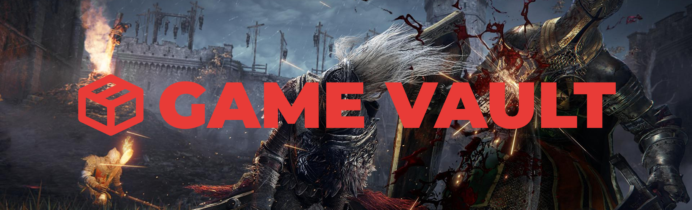

<p align="center">
  
</p>

<p align="center">
  <strong>A modern, elegant game save backup manager for Windows</strong>
</p>
<p align="center">
  <a href="https://github.com/Kawai-Senpai/GameVault/releases"></a>
  <a href="https://github.com/Kawai-Senpai/GameVault/releases"></a>
  <a href="https://github.com/Kawai-Senpai/GameVault/blob/main/LICENSE"></a>
</p>
<p align="center">
  <a href="https://ranitbhowmick.com">Created by Ranit Bhowmick</a>
</p>

---

## 📥 Download

**[⬇️ Download Latest Release (GameVault.exe)](https://github.com/Kawai-Senpai/GameVault/releases/latest)**

> No installation required! Just download and run the `.exe` file.

---

## ✨ Features

- 🎮 **Auto-detect games** – Automatically finds popular games and their save locations
- 💾 **Rolling backups** – Keep N most recent backups; older ones auto-delete
- 📦 **Backup Collections** – Organize backups into named collections (e.g., "Solo Run", "Co-op with Friends")
- 🏷️ **Named Backups** – Give each backup a custom name for easy identification
- 📁 **Custom Games** – Add any game with your own save folder paths
- 📝 **Quick Backup Shortcuts** – Generate `.bat` files for one-click backups
- 🔄 **Restore Anytime** – Restore any backup with a single click
- 🎨 **Modern Dark UI** – Clean, intuitive interface with a sleek dark theme
- 🔔 **Update Notifications** – Automatically checks for new versions
- ⚡ **CLI Support** – Backup games from the command line

---

## 🎮 Supported Games (50+)

- **FromSoftware:** Elden Ring, Nightreign, Dark Souls (1-3), Sekiro, Lies of P
- **Tomb Raider:** Full series (I-VI Remastered, Survivor trilogy, classics)
- **PlayStation Ports:** Uncharted, The Last of Us Part I & II
- **RPGs:** Witcher 3, Cyberpunk 2077, Baldur's Gate 3, Skyrim
- **Indies:** Hollow Knight, Celeste, Cuphead, Dead Cells, Hades
- **Survival:** Minecraft, Terraria, Valheim, Subnautica
- **And many more...**

> Don't see your game? Add any game manually with a custom save path!

## 📥 Installation

### Prerequisites
- **Python 3.10+** (for running from source)
- **Windows 10/11**

### Option 1: Run from Source

```bash
# Clone the repository
git clone https://github.com/Kawai-Senpai/GameVault.git
cd GameVault

# Install dependencies
pip install -r requirements.txt

# Run the app
python main.py
```

### Option 2: Build Standalone Executable

```bash
# Run the build script (creates dist/GameVault.exe)
build.bat
```

### Dependencies

| Package | Purpose |
|---------|---------|
| `customtkinter` | Modern UI framework |
| `Pillow` | Image/icon handling |

---

## 🚀 Quick Start

1. **Launch GameVault** – Run `python main.py` or `GameVault.exe`
2. **Set Backup Directory** – On first launch, choose where to store your backups
3. **Add a Game** – Click **+ Add Game** to search from the database or add a custom game
4. **Backup** – Select your game and click **Backup Now**
5. **Done!** – Your saves are safely backed up 🎉

---

## 📖 How to Use

### Adding Games

**From the Database:**
1. Click **+ Add Game** in the sidebar
2. Search for your game (e.g., "Elden Ring")
3. Select it from suggestions
4. Click **Add Selected**

**Custom Game:**
1. Click **+ Add Game** → **Add Custom Game**
2. Enter the game name and developer (optional)
3. Browse to the save folder location
4. Click **Add Custom Game**

### Creating Backups

1. Select a game from the sidebar
2. Click **Backup Now**
3. (Optional) Enter a custom name for the backup
4. (Optional) Choose or create a collection
5. Click **Backup**

### Using Collections

Collections help you organize backups for different playthroughs, characters, or scenarios.

**Creating a Collection:**
1. Select a game
2. Click **Manage Collections**
3. Enter a name (e.g., "Strength Build", "Co-op with Alex")
4. Click **Create**

**Saving to a Collection:**
1. When backing up, select a collection from the dropdown
2. Or leave as "Default" for uncategorized backups

**Managing Collections:**
- **Rename:** Click **Manage Collections** → select → **Rename**
- **Delete:** Only empty collections can be deleted (move backups first)

### Restoring Backups

1. Select a game
2. Find the backup you want (organized by collection)
3. Click **Restore**
4. Confirm – your current saves will be overwritten

### Quick Backup Shortcuts (.bat files)

Create one-click backup shortcuts to place next to your game executables:

1. Select a game
2. Click **Create Quick Backup .bat**
3. Choose where to save it (e.g., your game folder or Desktop)
4. Double-click the `.bat` file anytime to instantly backup

---

## ⌨️ CLI Mode

```bash
# List all available games
python main.py --list-games

# Backup a specific game by ID
python main.py --backup elden_ring

# Example output:
#   Backing up: Elden Ring
#   From: C:\Users\...\AppData\Roaming\EldenRing
#   SUCCESS! Backup created: elden_ring_20260114_153000
```

---

## 📂 Project Structure

```
GameVault/
├── main.py                # Entry point (GUI + CLI)
├── requirements.txt       # Python dependencies
├── build.bat              # Build script for .exe
├── core/
│   ├── backup_engine.py   # Backup/restore logic
│   ├── config_manager.py  # Settings management
│   ├── game_db.py         # Game database
│   ├── game_detector.py   # Auto-detection
│   └── bat_generator.py   # .bat shortcut generator
├── ui/
│   └── main_window.py     # GUI (CustomTkinter)
├── data/
│   ├── games.json         # Game database
│   └── config.json        # User settings (auto-generated)
└── assets/
    ├── GameVault.png      # App icon
    └── Poster.png         # Banner image
```

---

## ⚙️ Settings

Access **Settings** from the sidebar to configure:

| Setting | Description |
|---------|-------------|
| **Backup Directory** | Where all backups are stored |
| **Max Backups** | Rolling limit per game (default: 10) |

---

## 🤝 Contributing

Contributions are welcome! Here's how you can help:

### Getting Started

1. **Fork** the repository
2. **Clone** your fork:
   ```bash
   git clone https://github.com/YOUR_USERNAME/GameVault.git
   ```
3. **Create a branch** for your feature:
   ```bash
   git checkout -b feature/amazing-feature
   ```
4. **Make your changes** and test thoroughly
5. **Commit** with a clear message:
   ```bash
   git commit -m "Add: amazing feature that does X"
   ```
6. **Push** to your fork:
   ```bash
   git push origin feature/amazing-feature
   ```
7. **Open a Pull Request** with a description of your changes

### Contribution Ideas

- 🎮 Add more games to `data/games.json`
- 🌍 Add localization/translations
- 🐛 Fix bugs or improve error handling
- 📖 Improve documentation
- ✨ Suggest new features

### Code Style

- Follow existing code patterns
- Use meaningful variable/function names
- Add comments for complex logic
- Test your changes before submitting

---

## 📜 License

This project is open source and available under the [MIT License](LICENSE).

---

## 👤 Author

**Ranit Bhowmick**

- 🌐 Website: [ranitbhowmick.com](https://ranitbhowmick.com)
- 💼 GitHub: [@Kawai-Senpai](https://github.com/Kawai-Senpai)

---

<p align="center">
  <strong>⭐ If you find GameVault useful, consider giving it a star! ⭐</strong>
</p>

## License

MIT License - Free to use and modify!
